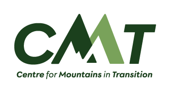
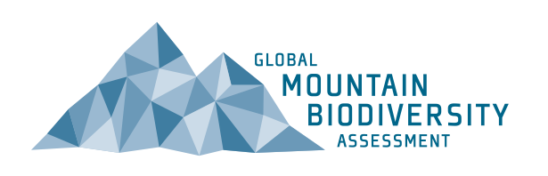
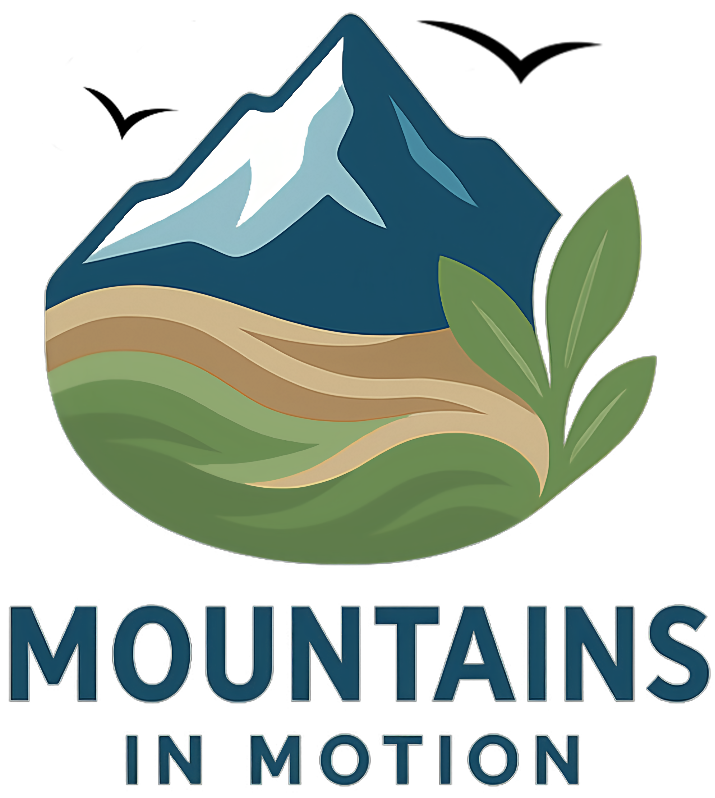

# _ValidRange_ project

## Overview
This repository contains the <b><em>ValidRange</em></b> project files.

The primary aim of the project is to refine our understanding of the environmental factors shaping species’ elevational distribution across mountains. To achieve this goal, we first focus on **developing a globally consistent assessment of species distributions across mountain regions**, information that is currently lacking, and urgently needed to anticipate the impacts of climate change on mountain biodiversity. The project focus on estimating the upper and lower elevational limits of species for four taxonomic groups: reptiles 🦎, birds 🐦, amphibians 🐸, and mammals 🦌.

Access to the dedicated platform is granted only to identified experts. If you want to be involved or if you have any questions, please do not hesitate to send us an email here: project-validrange@nmbu.no
  
## Status
This project is work in progress. We are currently reaching out to experts around the world.

## Project participants
### Institutions

      
      
      

This project is a global collaboration primarily carried out by the <a href="https://cmt.w.uib.no/" target="_blank" rel="noopener">Norwegian University of Life Sciences</a> (Ås, Norway), together with the <a href="https://cmt.w.uib.no/" target="_blank" rel="noopener">Centre for Mountains in Transitions</a> (Univ. of Bergen, Norway), the <a href="https://mountainsinmotion.w.uib.no/" target="_blank" rel="noopener">Mountains in Motion Research Team</a> (Univ. of Bergen, Norway) and the <a href="https://www.gmba.unibe.ch/" target="_blank" rel="noopener">Global Mountain Biodiversity Assessment</a> (Bern, Switzerland).

### The Team

  <strong>Benjamin Roux</strong>1,2 
  <em>PhD candidate</em>

  <strong>John-Arvid Grytnes</strong>1,2 
  <em>Professor</em> <strong>(Project Leader)</strong>

  <strong>Suzette Flantua</strong>3,4 
  <em>Associate Professor, Leader of Mountains in Motion – Research Team</em>

  <strong>Lotta Schultz</strong>3,4 
  <em>PhD candidate, Mountains in Motion – Research Team</em>

  <strong>Davnah Urbach</strong>5 
  <em>Executive Director, Global Mountain Biodiversity Assessment</em>

  <strong>Mark Snethlage</strong>5 
  <em>Science Officer, Global Mountain Biodiversity Assessment</em>

  <strong>Laura Camila Pacheco-Riaño</strong>6 
  <em>Postdoctoral Researcher, University of Gothenburg</em>

  <strong>Kari Klanderud</strong>1 
  <em>Professor</em>

<small>

1 Faculty of Environmental Sciences and Natural Resource Management, Norwegian University of Life Sciences, Ås, Norway  
 
2 Centre for Mountains in Transitions, University of Bergen, Bergen, Norway  
 
3 Department of Biological Sciences, University of Bergen, Bergen, Norway  
 
4 Bjerknes Centre for Climate Research, University of Bergen, Bergen, Norway  
 
5 Global Mountain Biodiversity Assessment, Institute of Plant Sciences, University of Bern, Bern, Switzerland  
 
6 Department of Biological and Environmental Sciences, University of Gothenburg, Gothenburg, Sweden

</small>

